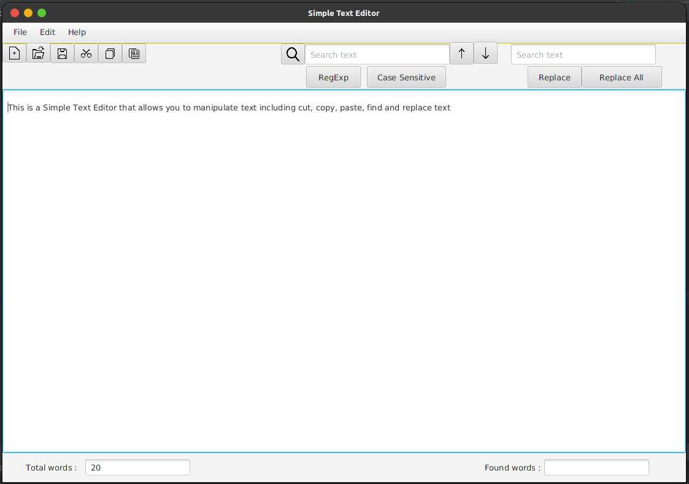

# Simple Text Editor
#### Overview

- This is a Simple Text Editor project that was created to enhance the developing skills along with version control.

#### Features
- This allows the user to manipulate text including cut, copy, paste, find and replace texts.

#### Tech Used / Dependencies

- Icons from : [Flaticon](https://www.flaticon.com/)

#### License

MIT License

Copyright © [2022] [H.G. Hashadhi Jayasinghe]

